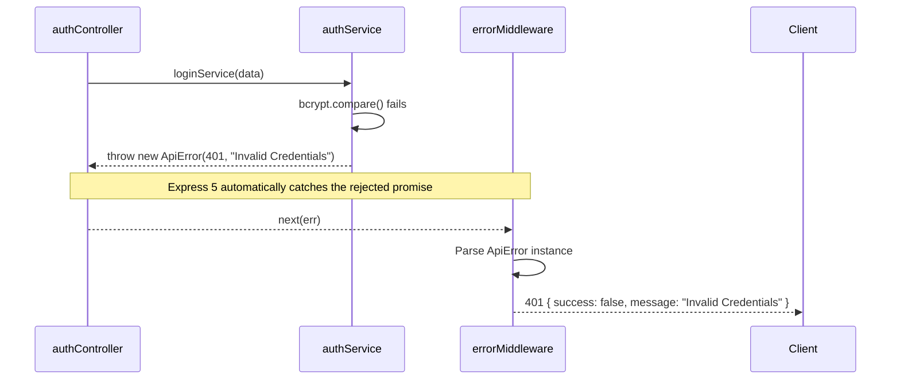

# API Design & Contracts

## 1. Overview
The mkthub backend exposes a fully RESTful HTTP API. To guarantee a predictable integration experience for frontend clients (React/Axios), the API enforces strict architectural boundaries: all routes follow semantic naming, all responses use a standardized JSON wrapper, and all errors are captured by a centralized error handler utilizing Express 5's native asynchronous promise resolution.

## 2. Why this module exists
In applications, inconsistent API responses (e.g., one controller returning `{ user: {} }` and another returning `[{ id: 1 }]`) create brittle frontends that require constant null-checking. By enforcing a single, uniform interface (`{ success, message, data }`), the frontend Axios interceptors and React Query hooks can safely and predictably parse every single endpoint.

## 3. Architecture

The API layer is structurally decoupled from business logic, functioning purely as a transport adapter.

```mermaid
graph TD
    Client[React Axios] -->|HTTP Request| Route[Express Router]
    Route --> Val[express-validator]
    Val --> Ctrl[Thin Controller]
    
    Ctrl -->|Delegates Logic| Svc[Service Layer]
    Svc -- Returns Data / Throws ApiError --> Ctrl
    
    Ctrl -->|Formats Success| Res[res.status(200).json]
    Ctrl -.->|Unhandled Promise (Express 5)| ErrMid[errorMiddleware.js]
    ErrMid -.->|Formats Failure| ResErr[res.status(400).json]
```

## 4. Execution Flows

### The Centralized Error Flow
Because mkthub utilizes **Express 5**, developers do not need to wrap every controller in `try/catch` blocks. Unhandled promises are automatically routed to the error middleware.



## 5. Step-by-step Implementation

1. **Routing Strategy:** Routes in `src/routes/` are grouped by domain (`authRoutes`, `productRoutes`, `orderRoutes`) and mounted in `app.js` under the `/api/` prefix to explicitly separate them from potential static asset serving.
2. **Thin Controllers:** Controllers in `src/controllers/` contain almost zero business logic. Their sole responsibility is extracting `req.body`, `req.user`, or `req.params`, passing them to the Service layer, and formatting the successful returned object into the standard `{ success, message, data }` format.
3. **Custom Exceptions:** Services throw instances of `src/utils/ApiErrors.js` (e.g., `throw new ApiError(404, "User not found")`) instead of generic Javascript `Error` objects, ensuring the exact HTTP status code bubbles up to the response.
4. **Error Interception:** `src/middleware/error/errorMiddleware.js` intercepts these errors, strips sensitive stack traces, gracefully handles Mongoose `11000` Duplicate Key errors, and returns a sanitized JSON response to the client.

## 6. Important Files

| File | Responsibility |
| :--- | :--- |
| `src/middleware/error/errorMiddleware.js` | The global net that catches and formats all application exceptions. |
| `src/utils/ApiErrors.js` | The custom Error class that allows services to specify HTTP status codes. |

## 7. Important Routes

| Route Prefix | Responsibility |
| :--- | :--- |
| `/api/auth` | JWT generation, session refreshing, and password resets. |
| `/api/product` | Public catalog access and seller-specific product management. |
| `/api/admin` | High-privilege administrative actions (RBAC enforced). |

## 8. Important Controllers

| Controller | Responsibility |
| :--- | :--- |
| `productController.js` | Demonstrates the "Thin Controller" pattern, wrapping `productService` methods and appending `success: true` metadata. |

## 9. Important Services
*N/A - Services perform the logic, but the API contract is enforced by the Controller.*

## 10. Important Middleware

| Middleware | Responsibility |
| :--- | :--- |
| `errorMiddleware` | Standardizes `{ success: false, message, errors }` payloads. |

## 11. Important Models
*N/A*

## 12. Important Utilities

| Utility | Responsibility |
| :--- | :--- |
| `ApiError` | Extends the native `Error` class to attach `statusCode` and `errorCode` properties. |

## 13. Engineering Decisions
> 📌 **Express 5 Migration:** The backend runs on `express: ^5.2.1`. Historically, Express required libraries like `express-async-errors` or explicit `next(err)` wrappers to handle asynchronous rejections. By adopting Express 5, the controllers remain clean and readable, as native async/await rejections automatically fall through to `errorMiddleware`.
> 
> 📌 **JSend-style formatting:** Every single endpoint (excluding third-party webhooks) returns an object starting with a `success` boolean. This allows the frontend Axios interceptors to easily differentiate between expected operational errors and unexpected crashes.

## 14. Technologies Used
- Express 5.2.1
- REST Architecture

## 15. Design Patterns Used
- **Thin Controllers:** Keeping controllers focused solely on HTTP request/response handling.
- **Facade Pattern:** Controllers act as a simple facade over complex, multi-step Service operations.

## 16. Software Engineering Principles
- **Uniform Interface:** Ensuring clients interact with every domain (Users, Products, Orders) using the exact same response parsing logic.
- **DRY (Don't Repeat Yourself):** Centralizing `res.status(500).json(...)` inside `errorMiddleware.js` rather than repeating try/catch blocks across 50+ controller functions.

## 17. Security Considerations
- > 🔒 **Stack Trace Sanitization:** `errorMiddleware.js` intentionally does not include `err.stack` in the JSON response. Leaking stack traces to the frontend exposes the internal directory structure and dependency versions to potential attackers.

## 18. Performance Optimizations
- > 🚀 **Synchronous Validation:** Schema validation (`express-validator`) runs as middleware *before* the controller is executed. If a request body is malformed, it is rejected instantly without spinning up a database connection or invoking complex service logic.

## 19. Failure Scenarios
- **What breaks if missing?** If `errorMiddleware.js` was omitted, an uncaught promise rejection inside a service would cause the Node.js process to hang for the client, eventually timing out without providing an actionable error message.

## 20. Future Improvements
- **OpenAPI / Swagger:** Generating an `openapi.yaml` specification directly from the Express routes would allow for auto-generated frontend SDKs and interactive API documentation for third-party consumers.

## 21. Key Takeaways
- Controllers are thin; Services own the business logic.
- Express 5 eliminates the need for `try/catch` boilerplate.
- `errorMiddleware.js` catches all exceptions and normalizes them.
- All responses strictly adhere to a `{ success, message, data }` contract.

## 22. Related Documentation
- [Frontend Architecture (frontend.md)](frontend.md)
- [Security Architecture (security.md)](security.md)
