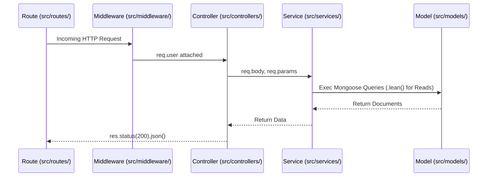

# System Architecture

## 1. Overview
The mkthub architecture is an event-driven, multi-vendor e-commerce platform. It enforces a separation of concerns, dividing the system into execution layers: Client SPA, Reverse Proxy, RESTful API, Transactional Database, and Background Processing. The architecture prioritizes non-blocking operations, offloading CPU/Network tasks to isolated workers while leveraging caching and native async error handling for throughput.

## 2. Why this module exists
Building e-commerce requires solving specific distributed state problems:
- **Thread Blocking:** Node.js is single-threaded. Generating PDF invoices via `pdfkit` synchronously would block the Express event loop. Offloading this to BullMQ keeps the checkout endpoints non-blocking.
- **Database Exhaustion:** E-commerce is heavily read-optimized. Querying MongoDB for complex filtered catalogs on every page load would exhaust CPU. The architecture uses a Cache-Aside pattern via Redis.
- **Out-of-Sync State:** Users abandoning a Razorpay checkout window lock inventory forever. A `node-cron` scheduler periodically audits and expires abandoned reservations, and a "Late Capture" refund mechanism gracefully handles edge cases where Razorpay completes a payment *after* an order was cancelled.

## 3. Architecture

```mermaid
graph TD
    Client[React 19 / Vite SPA] -->|HTTPS| Proxy[Nginx Container]
    
    subgraph Express HTTP Layer
        Proxy -->|/api/* (Port 3000)| API[Express 5 API: app.js]
        API -->|Mongoose ODM| DB[(MongoDB Atlas)]
        API -->|redis.utils.js| Cache[(Redis)]
    end
    
    subgraph Background Processing Layer
        Cache -->|BullMQ Jobs| Workers[startWorkers.js]
        Workers -->|invoiceQueue| PDF[pdfkit]
        Workers -->|emailQueue| Email[nodemailer]
        Cron[node-cron: schedular.js] -->|Audits Expirations| DB
    end
    
    API -->|HMAC Verification| Razorpay[Razorpay Webhooks]
    API -->|multer| Cloudinary[Cloudinary CDN]
```

## 4. Execution Flow

The backend enforces a strict Controller-Service-Model data flow for synchronous operations, heavily leaning on Express 5's native async rejection handling.



## 5. Step-by-step Implementation

1. **Client Rendering:** The React 19 frontend utilizes React Query to cache Server State globally, interacting with the backend via Axios interceptors that silently rotate JWT Refresh Tokens.
2. **Reverse Proxying:** Nginx acts as the primary ingress, terminating TLS 1.3 and routing `/api/` traffic to the backend, while serving static frontend assets.
3. **API Routing & Validation:** `src/app.js` catches traffic, applies global `helmet` security and `10kb` JSON payload limits, and passes it to domain-specific routers where `express-validator` and `validateAllowedFields` prevent mass assignment.
4. **Service Execution:** Thin controllers extract parameters and invoke `src/services/`. The service layer orchestrates MongoDB `startSession()` transactions, caching logic, and BullMQ enqueueing.
5. **Reconciliation:** The `reservationExpiryJob.js` cron periodically sweeps the database in batches of 50 to release locked inventory, acting as the system's asynchronous garbage collector.

## 6. Important Files

| File | Responsibility |
| :--- | :--- |
| `src/app.js` | Configures Express 5 middleware, including the centralized `errorMiddleware` that automatically catches unhandled promise rejections. |
| `src/server.js` | Initializes `connectDB()` and `connectRedis()`, then boots the HTTP server. |
| `src/jobs/startWorkers.js` | Secondary entry point that boots independent BullMQ queue consumers. |
| `src/jobs/reservation/schedular.js` | Binds the `node-cron` tick event to fire the asynchronous expiry processor every minute. |

## 7. Important Routes

| Route Module | Responsibility |
| :--- | :--- |
| `src/routes/paymentRoutes.js` | Binds HTTP controllers to Razorpay intent generation, strictly rate-limited to prevent inventory lock attacks. |
| `src/routes/webhookRoutes.js` | Mounted *before* `express.json()` to utilize `express.raw()`, ensuring raw HMAC verification of Razorpay payloads. |

## 8. Important Controllers

| Controller | Responsibility |
| :--- | :--- |
| `src/controllers/authController.js` | Sets `HttpOnly` cookies for JWT Refresh Tokens and handles multi-device logouts. |
| `src/controllers/productController.js` | Thin facade that extracts query strings (pagination/search) before passing them to the Cache-Aside service. |

## 9. Important Services

| Service | Responsibility |
| :--- | :--- |
| `src/services/orderService.js` | Wraps inventory deduction and order persistence inside an atomic Mongoose `ClientSession`. |
| `src/services/paymentService.js` | Handles webhook idempotency and implements the "Late Capture Refund" to automatically reimburse users if Razorpay processes a payment after an order was cancelled. |

## 10. Important Middleware

| Middleware | Responsibility |
| :--- | :--- |
| `src/middleware/auth/authorize.js` | Validates `req.user.role` against allowed roles via a Factory Pattern (RBAC). |
| `src/middleware/error/errorMiddleware.js` | Standardizes all exceptions (including Mongoose 11000 duplicate keys) into a `{ success: false, message }` JSend payload. |

## 11. Important Models

| Model | Responsibility |
| :--- | :--- |
| `src/models/Product.js` | Implements compound B-Tree indexes (e.g., `{ seller: 1, slug: 1 }`) to support rapid catalog filtering. |
| `src/models/Reservation.js` | Tracks transient state during the checkout flow, acting as the distributed lock for inventory. |

## 12. Important Utilities

| Utility | Responsibility |
| :--- | :--- |
| `src/utils/redis.utils.js` | Implements graceful degradation for Cache-Aside reads. If Redis fails, it falls back to MongoDB instead of crashing. |
| `src/utils/pagination.utils.js` | Enforces a strict `MAX_LIMIT = 100` to prevent database memory exhaustion via massive `$skip`/`$limit` parameters. |

## 13. Engineering Decisions
> 📌 **Express 5 Native Async:** By migrating to Express 5, the architecture completely eliminates `try/catch` boilerplate in controllers. Any rejected promise in a service automatically falls through to the global error middleware, keeping code exceptionally clean.
>
> 📌 **Late Capture Compensation:** Network latency can cause a user to abandon checkout, triggering the Cron Scheduler to cancel the order. If Razorpay captures the payment later, `paymentService.js` detects the discrepancy and triggers a refund, maintaining financial integrity.

## 14. Technologies Used
- React 19 / Vite / React Query
- Node.js (Express 5.2.1)
- Mongoose 8.x
- BullMQ & Redis
- Node-Cron
- Nginx & Docker

## 15. Design Patterns Used
- **Layered Architecture:** Enforced via physical boundaries between Controllers (HTTP) and Services (Business Logic).
- **Idempotent Webhooks:** Ensuring duplicate `payment.captured` webhooks do not result in double-shipping.
- **Cache-Aside:** Masking database latency by serving hot catalog data from RAM.

## 16. Software Engineering Principles
- **Eventual Consistency:** Relying on webhooks and cron jobs to eventually synchronize MongoDB state with external payment gateways.
- **Fail-Fast:** Middleware like `validateAllowedFields` immediately rejects malicious mass-assignment payloads before they touch the database.

## 17. Security Considerations
- > 🔒 **Stateless + Stateful Auth:** Access Tokens are short-lived JWTs (stateless performance), while Refresh Tokens are checked against a `SessionModel` in MongoDB (stateful revocation).

## 18. Performance Optimizations
- > 🚀 **Mongoose `.lean()`:** Deep catalog queries in `productService.js` utilize `.lean()` to return raw POJOs instead of Mongoose Documents, reducing Node.js Garbage Collection overhead.

## 19. Failure Scenarios
- **What breaks if missing?** If the Nginx reverse proxy was removed, Node.js would have to handle TLS termination and serve React static bundles, consuming the single thread's CPU cycles needed to process API requests.

## 20. Future Improvements
- **Elasticsearch Integration:** Offload product search from MongoDB to Elasticsearch via Change Streams for search capabilities.

## 21. Key Takeaways
- The backend leverages Express 5 for clean async error handling.
- Complex multi-step database writes are guaranteed by Mongoose Transactions.
- Memory and CPU are heavily guarded by payload limits, pagination boundaries, and BullMQ workers.
- The React SPA is cleanly decoupled and relies heavily on React Query for caching.

## 22. Related Documentation
- [Deployment (deployment.md)](deployment.md)
- [Performance (performance.md)](performance.md)
- [Frontend (frontend.md)](frontend.md)
