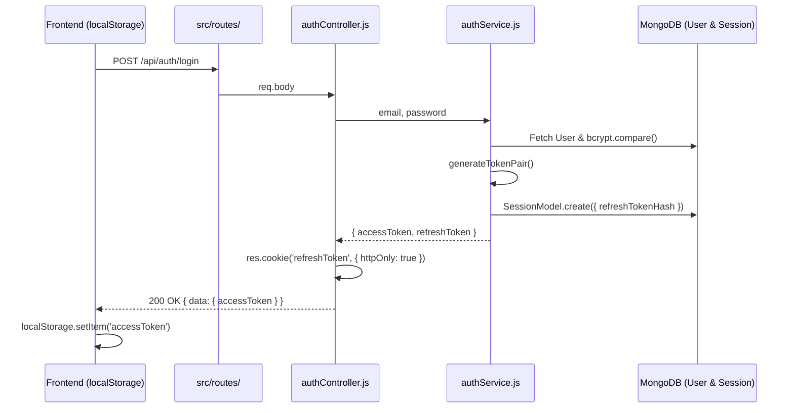
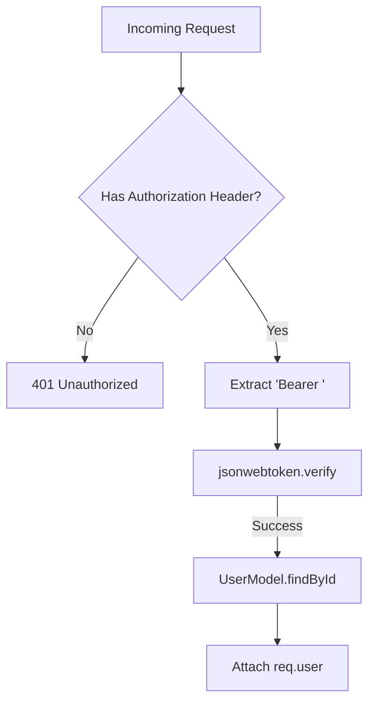

# Authentication Implementation

## 1. Overview
The mkthub authentication module utilizes a hybrid stateful/stateless dual-token JWT architecture. 
- **Access Tokens** are stateless, short-lived (15 minutes), returned via JSON payload, and transported as HTTP `Bearer` headers.
- **Refresh Tokens** are stateful, long-lived (7 days), stored in MongoDB (`SessionModel`), and transported exclusively via `HttpOnly` cookies.

## 2. Why this module exists
This hybrid model balances performance and security:
- Stateless Access Tokens mean `req.user` validation occurs entirely in memory without hitting the database, preserving API performance.
- Stateful Refresh Tokens allow administrators to instantly revoke compromised sessions globally (e.g., during a password reset or ban) while still protecting the refresh token from Cross-Site Scripting (XSS) via `HttpOnly` cookies.

## 3. Architecture

## 4. Execution Flow
The authorization flow reads the `Bearer` token from the header, not a cookie.

## 5. Step-by-step Implementation

1. **Token Generation:** Upon successful `bcrypt.compare`, `authService.loginService` invokes `generateAccessToken` and `generateRefreshToken`.
2. **Session Persistence (State):** The service hashes the refresh token via `hashToken()` and saves it to MongoDB (`SessionModel.create`).
3. **Dispatch:** `authController.login` attaches the `refreshToken` to an `HttpOnly` cookie and returns the `accessToken` inside the JSON response.
4. **Client Storage:** `frontend/src/api/axiosClient.js` stores the `accessToken` in `localStorage`.
5. **Route Protection:** `src/middleware/auth/authMiddleware.js` intercepts requests, splits the `Authorization` header, verifies the JWT, queries the `User` model, and attaches `req.user`.
6. **Silent Refresh Interceptor:** If the access token expires (15m), the Axios response interceptor catches the `401`. It pauses all outbound requests in a `failedQueue` and posts to `/auth/refresh`. The browser sends the `HttpOnly` refresh cookie, which `authService.refreshSession` validates against the database. If valid, a new access token is returned and the original queued requests are replayed.

## 6. Important Files

| File | Responsibility |
| :--- | :--- |
| `src/middleware/auth/authMiddleware.js` | Parses the `Bearer` header and verifies the JWT signature. |
| `src/services/authService.js` | Executes `bcrypt` and handles `SessionModel` mutations. |
| `frontend/src/api/axiosClient.js` | Implements the queueing mechanism to silently refresh tokens on `401` errors. |

## 7. Important Routes

| Route | Responsibility |
| :--- | :--- |
| `POST /api/auth/refresh` | Consumes the `HttpOnly` refresh cookie, checks MongoDB, and issues a new `accessToken`. |
| `POST /api/auth/logoutAllDevices` | Revokes all active sessions for a user by updating `SessionModel.revokedAt`. |

## 8. Important Controllers

| Controller | Responsibility |
| :--- | :--- |
| `authController.login` | Handles the dual-dispatch: JSON payload for `accessToken` + Cookie for `refreshToken`. |

## 9. Important Services

| Service | Responsibility |
| :--- | :--- |
| `authService.refreshSession` | Hashes the incoming refresh token, finds the active session, generates a new refresh token, rotates it in the DB, and returns the new access token. |

## 10. Important Middleware

| Middleware | Responsibility |
| :--- | :--- |
| `authMiddleware.js` | The gatekeeper for protected endpoints; executes `jwt.verify`. |

## 11. Important Models

| Model | Responsibility |
| :--- | :--- |
| `SessionModel` | Enforces the stateful architecture. Utilizes a TTL index (`expireAfterSeconds: 0`) to automatically purge expired refresh hashes from the database. |

## 12. Important Utilities

| Utility | Responsibility |
| :--- | :--- |
| `tokenUtils.js` | Centralizes `generateAccessToken`, `generateRefreshToken`, and the `hashToken` crypto logic. |

## 13. Engineering Decisions
> 📌 **Token Hashing:** The `SessionModel` does NOT store the raw refresh token. Instead, it stores `refreshTokenHash` generated via Node's `crypto` module. If the MongoDB database is compromised, the attackers cannot use the hashes to generate valid refresh cookies.

## 14. Technologies Used
- `jsonwebtoken`
- `bcrypt`
- Node native `crypto`
- Axios Interceptors

## 15. Design Patterns Used
- **Interceptor Pattern:** Employed on the frontend to manage a `failedQueue` array, pausing network traffic while token rotation occurs seamlessly.
- **Token Rotation Pattern:** During a refresh, the old refresh token is swapped for a new one in the database, preventing token reuse.

## 16. Software Engineering Principles
- **Defense in Depth:** The architecture assumes tokens can be compromised, utilizing rapid expiration (15m) combined with database-backed session revocation.

## 17. Security Considerations
- > 🔒 **Local Storage Risk:** Because the `accessToken` is stored in `localStorage`, it is theoretically vulnerable to XSS. However, because its lifespan is strictly 15 minutes, the attack window is narrow. The permanent key (the refresh token) remains safely isolated in an `HttpOnly` cookie.

## 18. Performance Optimizations
- > 🚀 **TTL Indexing:** `SessionModel` utilizes a MongoDB TTL index on the `expiresAt` field. MongoDB automatically deletes expired sessions in the background, preventing table bloat without requiring a manual CRON job.

## 19. Failure Scenarios
- **What breaks if missing?** If `SessionModel.updateMany({ revokedAt: new Date() })` was omitted during a `changePassword` operation, a stolen device with an active refresh cookie could remain permanently logged in despite the password being changed.

## 20. Future Improvements
- **Memory Caching for Sessions:** Currently, `authMiddleware.js` executes `UserModel.findById()` on every protected route. Moving active session/user data to Redis would shave several milliseconds off database query times per request.

## 21. Key Takeaways
- mkthub uses a hybrid architecture: Access tokens are Bearer headers; Refresh tokens are `HttpOnly` cookies.
- Refresh tokens are explicitly tracked in MongoDB (`SessionModel`) allowing instant, global revocation.
- The frontend seamlessly handles 401s via an Axios interceptor queue.

## 22. Related Documentation
- [Authorization (authorization.md)](authorization.md)
- [Security (security.md)](security.md)
