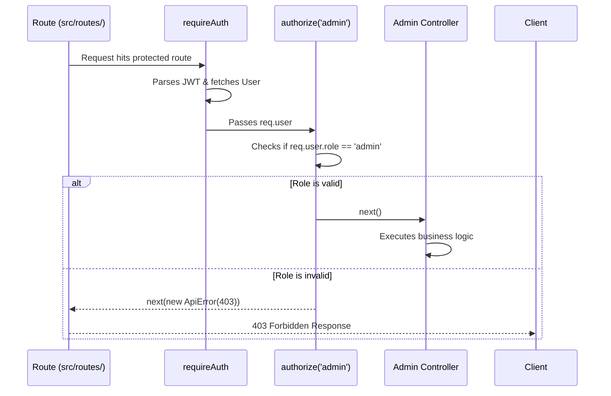
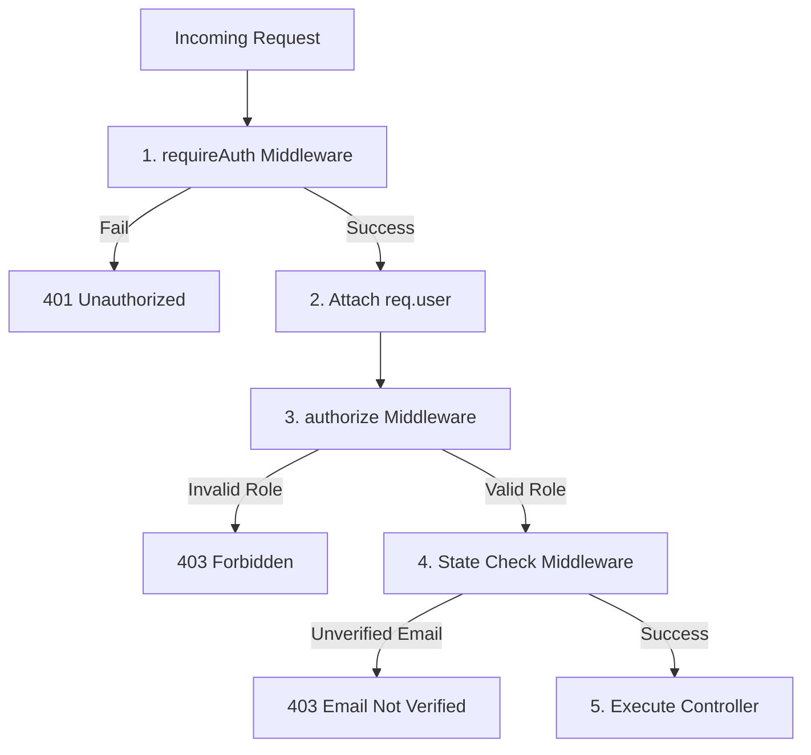

# Authorization Implementation

## 1. Overview
The mkthub authorization module implements Role-Based Access Control (RBAC) and state-based security checks using Express middleware. It prevents unauthorized execution of controllers by failing fast and rejecting HTTP requests at the route boundary.

## 2. Why this module exists
While authentication (`requireAuth.js`) proves *who* a user is, authorization proves *what* they are allowed to do. This module exists to:
- Prevent a `customer` from accessing `admin` dashboards (Vertical Privilege Escalation).
- Prevent unverified users or banned sellers from mutating critical database collections (like creating products or placing orders).

## 3. Architecture

## 4. Execution Flow
The authorization flow relies on chained middlewares executing sequentially.

## 5. Step-by-step Implementation

1. **Route Definition:** In `src/routes/adminRoutes.js`, the route is defined as `router.get('/stats', requireAuth, authorize('admin'), getStats)`.
2. **Identity Hydration:** The `requireAuth` middleware successfully extracts the JWT, queries the database, and attaches the `User` document to `req.user`.
3. **Factory Instantiation:** The `authorize` middleware executes. Because it is a Factory Function, it creates a closure around the `['admin']` array.
4. **Role Validation:** The middleware checks `roles.includes(req.user.role)`.
5. **Rejection or Progression:** If `req.user.role` is `customer`, it immediately throws an `ApiError(403)`. If it is `admin`, it calls `next()` to hand execution to the controller.

## 6. Important Files

| File | Responsibility |
| :--- | :--- |
| `src/middleware/auth/authorize.js` | The RBAC middleware factory function. |
| `src/middleware/auth/requireVerifiedEmail.js` | A specific state-based barrier middleware. |

## 7. Important Routes

| Route Module | Responsibility |
| :--- | :--- |
| `src/routes/adminRoutes.js` | Secures administrative endpoints using `authorize('admin')`. |
| `src/routes/sellerRoutes.js` | Secures inventory endpoints using `authorize('seller', 'admin')`. |

## 8. Important Controllers
*N/A - This module's entire purpose is to prevent unauthorized execution of controllers.*

## 9. Important Services
*N/A - Authorization happens exclusively at the HTTP boundary before services are invoked.*

## 10. Important Middleware

| Middleware | Responsibility |
| :--- | :--- |
| `authorize(...roles)` | Dynamically intercepts requests based on an array of permitted roles. |
| `requireVerifiedEmail` | Checks `req.user.isEmailVerified` before allowing mutations. |

## 11. Important Models

| Model | Responsibility |
| :--- | :--- |
| `src/models/User.js` | Enforces the `enum: ['customer', 'seller', 'admin']` boundary on the `role` field. |

## 12. Important Utilities

| Utility | Responsibility |
| :--- | :--- |
| `src/utils/ApiErrors.js` | Used to throw standardized HTTP 403 (Forbidden) exceptions. |

## 13. Engineering Decisions
> 📌 **Middleware Factory Pattern:** Instead of hardcoding separate functions like `isAdmin`, `isSeller`, or `isSellerOrAdmin`, mkthub uses a single higher-order function: `authorize(...roles)`. This allows infinitely flexible, declarative route definitions directly in the router files.

## 14. Technologies Used
- Express Middlewares

## 15. Design Patterns Used
- **Factory Pattern:** `const authorize = (...roles) => { return (req, res, next) => { ... } }`
- **Chain of Responsibility (Middleware Chain):** `requireAuth` -> `authorize` -> `requireVerifiedEmail`.

## 16. Software Engineering Principles
- **Fail-Fast (Defensive Programming):** The system rejects unauthorized payloads at the earliest possible network boundary, before memory is allocated to parse large JSON bodies or execute complex database queries.

## 17. Security Considerations
- > 🔒 **State-Based Barriers:** Because JWTs are stateless, a user banned by an admin will still possess a valid token until it expires. Middlewares like `requireVerifiedEmail` act as active defensive layers, directly inspecting the live `req.user` state fetched during `requireAuth` to enforce real-time restrictions.

## 18. Performance Optimizations
- > 🚀 **No Additional Database Queries:** The `authorize` middleware executes a simple array lookup (`roles.includes(req.user.role)`). It does not query MongoDB, because `requireAuth` already hydrated the `req.user` object in the previous middleware step.

## 19. Failure Scenarios
- **What breaks if missing?** If a route developer forgets to append `authorize('admin')` to a new destructive endpoint (e.g., `DELETE /api/users`), any authenticated user with a valid JWT could invoke the controller, leading to catastrophic data loss via Privilege Escalation.

## 20. Future Improvements
- **Granular Permissions:** Currently, authorization is strictly Role-Based. Future iterations could implement Attribute-Based Access Control (ABAC) to allow policies like "A seller can only edit products they own."

## 21. Key Takeaways
- mkthub enforces security declaratively at the route definition.
- `authorize` is a factory function, not a standard middleware.
- Security checks happen synchronously in memory without additional database trips.

## 22. Related Documentation
- [Authentication (authentication.md)](authentication.md)
- [API Conventions (api.md)](api.md)
