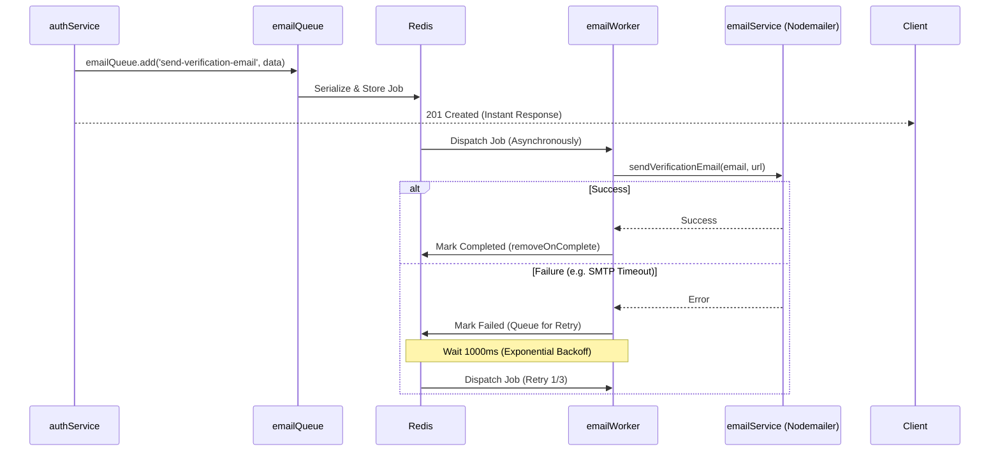

# Background Workers (BullMQ)

## 1. Overview
The mkthub backend utilizes **BullMQ** backed by Redis to implement a robust Producer/Consumer message queue system. This module is responsible for asynchronously processing CPU-intensive or latent I/O tasks outside of the main Express API lifecycle.

## 2. Why this module exists
- **Event Loop Preservation:** Node.js runs on a single-threaded event loop. If the Express controller synchronously generates a PDF using `pdfkit` (which is CPU-bound), the entire API blocks, preventing other users from loading the website.
- **Fault Tolerance:** Sending emails via SMTP (`nodemailer`) can fail due to network latency or third-party outages. If executed synchronously, the API request fails. By using BullMQ, mkthub automatically retries failed emails in the background using exponential backoff without disrupting the user experience.

## 3. Architecture

```mermaid
graph TD
    subgraph Express HTTP Layer
        API[Express Controllers / Services]
    end
    
    subgraph BullMQ Broker
        Redis[(Redis Server)]
        Q1[emailQueue]
        Q2[invoice-queue]
    end
    
    subgraph Worker Process
        Boot[startWorkers.js]
        W1[emailWorker.js]
        W2[invoiceWorker.js]
    end
    
    API -->|queue.add()| Q1
    API -->|queue.add()| Q2
    Q1 -->|Push Job| Redis
    Q2 -->|Push Job| Redis
    Redis -->|Consume Job| W1
    Redis -->|Consume Job| W2
    
    W1 -->|SMTP| Nodemailer
    W2 -->|CPU| PDFKit
```

## 4. Execution Flows

### The Producer-Consumer Flow
The following flow demonstrates how `authService.js` offloads email sending during user registration.



## 5. Step-by-step Implementation

1. **Broker Initialization:** `src/jobs/shared/bull.js` exports the `Queue` and `Worker` classes attached to the `redisConnection`.
2. **Queue Definition:** `src/jobs/email/emailQueue.js` configures the queue parameters (3 attempts, exponential backoff, job purging).
3. **Producer Execution:** Inside `src/services/authService.js`, the service calls `emailQueue.add(...)` rather than calling the email logic directly.
4. **Worker Bootstrapping:** `src/jobs/startWorkers.js` is required, which instantiates the consumers.
5. **Consumer Execution:** `src/jobs/email/emailWorker.js` listens to the queue, extracts the payload, and executes the actual business logic (`sendVerificationEmail`).

## 6. Important Files

| File | Responsibility |
| :--- | :--- |
| `src/jobs/shared/bull.js` | Centralizes the Redis connection injection for all BullMQ instances. |
| `src/jobs/startWorkers.js` | The entry point that attaches consumers to the queue. |
| `src/jobs/invoice/invoiceWorker.js` | Binds the PDF generation logic to the `invoice-queue`. |

## 7. Important Routes
*N/A - BullMQ operates entirely independently of the HTTP routing layer.*

## 8. Important Controllers
*N/A*

## 9. Important Services

| Service | Responsibility |
| :--- | :--- |
| `src/services/authService.js` | Acts as a Producer, enqueuing verification and reset emails. |
| `src/services/orderService.js` | Acts as a Producer, enqueuing PDF generation upon successful checkout. |

## 10. Important Middleware
*N/A*

## 11. Important Models
*N/A*

## 12. Important Utilities
*N/A*

## 13. Engineering Decisions
> 📌 **Job Purging Strategy:** `emailQueue.js` explicitly defines `removeOnComplete: 100` and `removeOnFail: 50`. Without these configurations, BullMQ would store every executed job in Redis forever, eventually causing an Out-Of-Memory (OOM) crash.
> 
> 📌 **Exponential Backoff:** Configured as `{ type: "exponential", delay: 1000 }`. If the SMTP server is rate-limiting the application, immediately retrying will just result in another failure. Exponential backoff naturally throttles the retry rate.

## 14. Technologies Used
- `bullmq`
- Redis
- `nodemailer` (via Worker)
- `pdfkit` (via Worker)

## 15. Design Patterns Used
- **Producer / Consumer Pattern:** Separates the job creator (`authService`) from the job executor (`emailWorker`).
- **Message Broker:** Redis acts as the persistent middleman.

## 16. Software Engineering Principles
- **Asynchronous Execution:** Enhances the perceived performance of the API by returning HTTP responses instantly before heavy operations complete.
- **Resiliency:** Built-in retry mechanisms ensure transient network failures do not result in permanent data loss.

## 17. Security Considerations
- > 🔒 **Payload Serialization:** Data passed into `queue.add()` is serialized to JSON. Functions, buffers, or complex Mongoose documents cannot be passed directly through BullMQ. The system correctly passes primitive identifiers (like `orderId` or `email`) and allows the Worker to fetch the necessary data.

## 18. Performance Optimizations
- > 🚀 **Process Independence:** `startWorkers.js` is designed so it can be spun up in a completely separate Docker container. This allows the heavy CPU load of PDF generation to run on isolated hardware without impacting the Express API web servers.

## 19. Failure Scenarios
- **What breaks if missing?** If Redis crashes, `queue.add()` will throw an exception. However, because mkthub wraps `emailQueue.add` inside `try/catch` blocks (as seen in `authService.js`), a Redis failure will *not* crash the API. The user will successfully register, though the email will not be sent.

## 20. Future Improvements
- **Dead Letter Queue (DLQ):** Currently, if a job fails 3 times, it sits in the failed queue until it gets purged (after 50 failures). Implementing a DLQ to push permanently failed jobs into MongoDB would allow administrators to inspect and manually replay them.

## 21. Key Takeaways
- mkthub uses BullMQ and Redis for robust background processing.
- Queues are configured with auto-purging and exponential backoffs.
- Producers and Consumers are strictly decoupled to maintain Express event loop performance.

## 22. Related Documentation
- [Architecture (architecture.md)](architecture.md)
- [Redis Caching (redis.md)](redis.md)
