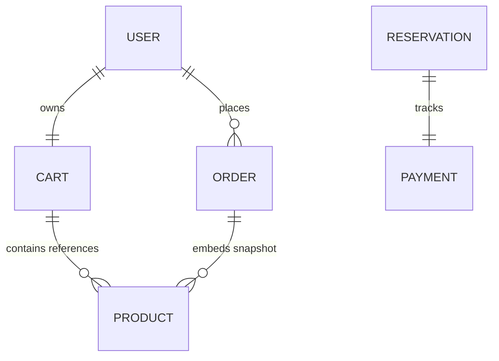
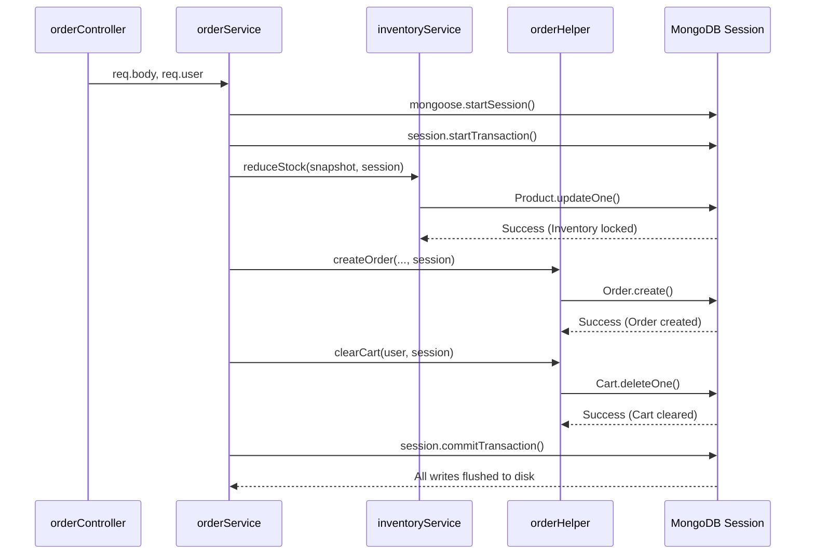
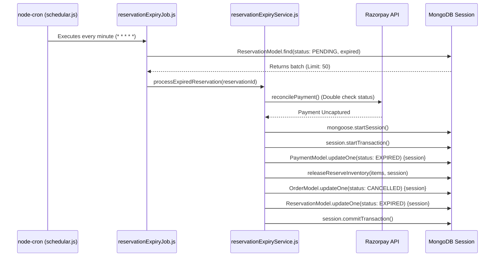

# Database Implementation & Transactions

## 1. Overview
The mkthub database layer leverages MongoDB and Mongoose (`src/models/`) to enforce strict application-level schemas, indices, and references. To guarantee ACID compliance during complex, multi-document mutations (like checking out a shopping cart, or expiring an abandoned reservation), the application relies heavily on MongoDB native sessions orchestrated at the Service layer.

## 2. Why this module exists
In an e-commerce platform, a checkout consists of multiple distinct database writes: deducting inventory, saving the order, and clearing the cart. If the server crashes after deducting inventory but before saving the order, data becomes corrupted. 
Furthermore, if a user reserves inventory but never completes the Razorpay payment, that inventory is "stranded". The transactional modules and background schedulers exist exclusively to guarantee Atomicity: either a checkout completely succeeds, or an abandoned checkout is reverted, restoring inventory.

## 3. Architecture

## 4. Execution Flows

### Flow A: The Checkout Transaction
The following flow demonstrates how `orderService.js` executes a multi-document transaction by orchestrating isolated helper services.

### Flow B: The Scheduled Expiry Transaction (Cron)
If a user abandons the checkout window, the inventory remains locked in a `Reservation`. A `node-cron` scheduler periodically audits and rolls back these abandoned documents safely.

## 5. Step-by-step Implementation (Cron Expiry)

1. **Scheduler Boot:** `src/jobs/reservation/schedular.js` registers a cron job that executes `* * * * *` (every minute), protected by an `isRunning` mutex to prevent overlapping sweeps.
2. **Batch Query:** `reservationExpiryJob.js` queries `ReservationModel` for documents where `status: "PENDING"` and `expiresAt` is past the 2-minute grace period, limiting the batch to 50 documents.
3. **Reconciliation:** For each reservation, `reservationExpiryService.js` invokes `reconcilePayment`. This explicitly calls the Razorpay API to verify the payment wasn't secretly captured (e.g., if a webhook failed to deliver).
4. **Transaction Initialization:** If the payment is truly dead, the service invokes `mongoose.startSession()` and `session.startTransaction()`.
5. **Rollback Operations:** Inside the transaction, the `Payment` is marked as `EXPIRED`, the `Order` is marked as `CANCELLED`, and `inventoryService.releaseReserveInventory` is invoked to add the stock back to the `Product` collection.
6. **Commit:** `session.commitTransaction()` executes, atomically reverting the abandoned checkout.

## 6. Important Files

| File | Responsibility |
| :--- | :--- |
| `src/services/order/orderService.js` | Orchestrates the `startSession` for successful checkouts. |
| `src/services/reservationExpiryService.js` | Orchestrates the `startSession` for rollback/expiry operations. |
| `src/jobs/reservation/schedular.js` | Binds the `node-cron` trigger to initiate the rollback workflow. |
| `src/jobs/reservation/reservationExpiryJob.js` | Handles the batching query to prevent RAM exhaustion when processing thousands of expirations. |

## 7. Important Routes
*N/A - The Cron Scheduler executes completely independently of the HTTP layer.*

## 8. Important Controllers
*N/A*

## 9. Important Services

| Service | Responsibility |
| :--- | :--- |
| `reservationExpiryService.js` | Owns the rollback transaction boundary, inventory release, and Razorpay reconciliation logic. |

## 10. Important Middleware
*N/A*

## 11. Important Models

| Model | Responsibility |
| :--- | :--- |
| `src/models/Reservation.js` | Contains the `expiresAt` field used by the Cron job to query abandoned carts. |

## 12. Important Utilities
*N/A*

## 13. Engineering Decisions
> 📌 **Batch Processing Limits:** `reservationExpiryJob.js` strictly limits queries to `.limit(50)`. If a massive flash sale creates 10,000 abandoned reservations, fetching them all into memory would crash the V8 engine. By processing 50 per minute, the system degrades gracefully.
> 
> 📌 **Mutex Locking:** `schedular.js` sets `let isRunning = false`. If Razorpay API latency causes a batch of 50 to take longer than 1 minute to process, the next Cron tick sees `isRunning = true` and silently skips execution, preventing race conditions on the database.

## 14. Technologies Used
- MongoDB Atlas
- Mongoose `ClientSession`
- `node-cron`

## 15. Design Patterns Used
- **Active Record / Data Access Object:** Enforced via Mongoose models.
- **Scheduled Sweeper Pattern:** Periodically auditing and purging invalid database states in the background rather than relying on synchronous API triggers.

## 16. Software Engineering Principles
- **Atomicity:** Rollbacks execute within transactions; if releasing inventory succeeds but updating the Order fails, the entire expiry rolls back, ensuring stock isn't artificially inflated.
- **Idempotency:** The query explicitly searches for `status: "PENDING"`. If the job accidentally runs twice on the same Reservation, the second run yields 0 documents, preventing double-releasing inventory.

## 17. Security Considerations
- > 🔒 **Defensive Reconciliation:** The scheduler does not blindly expire reservations. It queries Razorpay (`reconcilePayment`) first. This prevents a catastrophic edge case where a slow payment goes through, but the system cancels the order and releases the stock to someone else.

## 18. Performance Optimizations
- > 🚀 **Targeted Projection:** The cron query executes `.select("_id").lean()`. It doesn't fetch massive product arrays or populate references, keeping the MongoDB working set lean during background sweeps.

## 19. Failure Scenarios
- **What breaks if missing?** If the `node-cron` job dies, all users who abandon the Razorpay page will hold the inventory in a "PENDING" Reservation state. Over time, the store will appear completely "Out of Stock" even though no items were actually purchased.

## 20. Future Improvements
- **Distributed Cron:** Currently, `node-cron` runs in memory. If mkthub scales to 5 Node containers, 5 cron jobs will fire simultaneously. Migrating this scheduled task into BullMQ's repeatable jobs would ensure exactly-once execution across a distributed cluster.

## 21. Key Takeaways
- mkthub uses background cron scheduling to enforce eventual consistency.
- Abandoned checkouts are safely reverted using Mongoose transactions.
- The `node-cron` job implements mutexes, batch limits, and Razorpay reconciliation to prevent destructive race conditions.

## 22. Related Documentation
- [Architecture (architecture.md)](architecture.md)
- [BullMQ Queues (bullmq.md)](bullmq.md)
