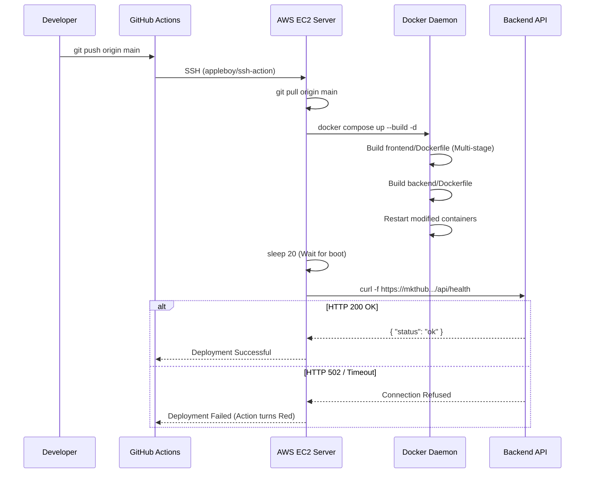

# Deployment & Infrastructure

## 1. Overview
The mkthub application utilizes a containerized microservice architecture deployed via **Docker Compose**. The entire stack (Frontend, Backend, Redis, and a Reverse Proxy) is orchestrated on a single AWS EC2 instance. Continuous Deployment (CD) is automated via **GitHub Actions**.

## 2. Why this module exists
- **Environment Consistency:** Standardizing the application inside `node:22-alpine` containers ensures that the code runs identically in development (`docker-compose.dev.yml`) and production (`docker-compose.yml`).
- **TLS Termination:** Managing SSL certificates directly inside Express is error-prone. Isolating a dedicated Nginx container to handle Certbot and HTTPS allows the Express API to remain completely agnostic of network encryption.
- **Automated Delivery:** Manual SSH deployments are risky. The `.github/workflows/deploy.yml` pipeline enforces a repeatable, audited release process.

## 3. Architecture

```mermaid
graph TD
    User[Internet Users] -->|HTTPS :443| Nginx Proxy[Nginx Container]
    
    subgraph AWS EC2 (Docker Host)
        Nginx Proxy -->|/api/*| Backend[Express Container :3000]
        Nginx Proxy -->|/*| Frontend[React Nginx Container :80]
        
        Backend -->|TCP :6379| Redis[(Redis Container)]
        Backend -->|Mongoose| Atlas[(MongoDB Atlas Cloud)]
        
        Certbot[Certbot Sidecar] -->|Renew Certs| Nginx Proxy
    end
```

## 4. Execution Flows

### The Continuous Deployment Flow
The following sequence demonstrates how code pushed to the `main` branch automatically deploys to the EC2 instance.



## 5. Step-by-step Implementation

1. **Frontend Build:** The `frontend/Dockerfile` utilizes a two-stage build. Stage 1 (`node:22-alpine`) installs dependencies and runs `npm run build`. Stage 2 copies the `/dist` artifacts into an `nginx:alpine` image to statically serve the React SPA.
2. **Backend Build:** The `backend/Dockerfile` runs `npm ci --omit=dev` to ensure testing/linting libraries are not shipped to production, keeping the image lean.
3. **Orchestration:** `docker-compose.yml` ties the services together on a bridge network, defining internal DNS names (e.g., the backend connects to `redis:6379`, not `localhost`).
4. **Ingress Routing:** The root `nginx/default.conf` listens on port 443. It proxies requests matching `/api/` to `http://backend:3000` and all other requests `/` to `http://frontend:80`.
5. **Automation:** The `.github/workflows/deploy.yml` script executes the deployment automatically when a PR is merged into `main`.

## 6. Important Files

| File | Responsibility |
| :--- | :--- |
| `docker-compose.yml` | The declarative infrastructure definition for production. |
| `.github/workflows/deploy.yml` | The CI/CD pipeline definition. |
| `nginx/default.conf` | The reverse proxy configuration, TLS definition, and Certbot ACME challenge route. |
| `frontend/Dockerfile` | Defines the multi-stage build for the React SPA. |
| `backend/Dockerfile` | Defines the runtime environment for the Node.js API. |

## 7. Important Routes
*N/A - Infrastructure level.*

## 8. Important Controllers

| Controller | Responsibility |
| :--- | :--- |
| `src/controllers/healthController.js` | Returns a `200 OK` used by the GitHub Action `curl` command to verify the container successfully booted. |

## 9. Important Services
*N/A*

## 10. Important Middleware
*N/A*

## 11. Important Models
*N/A*

## 12. Important Utilities
*N/A*

## 13. Engineering Decisions
> 📌 **Double Nginx Proxy:** The architecture technically uses Nginx twice. The root Nginx container terminates SSL and routes traffic. The frontend Nginx container simply serves static HTML/JS files. This cleanly separates the security concern (TLS) from the delivery concern (SPA hosting).
> 
> 📌 **Multi-stage Frontend Dockerfile:** The `node_modules` directory for a React app is large. By using `FROM nginx:alpine` as the final stage and only copying `/app/dist`, the final Docker image shrinks, speeding up deployments and saving disk space on EC2.

## 14. Technologies Used
- Docker & Docker Compose
- GitHub Actions
- Nginx
- Certbot (Let's Encrypt)
- AWS EC2

## 15. Design Patterns Used
- **Reverse Proxy:** Centralizing TLS termination and routing.
- **Sidecar Pattern:** The Certbot container runs alongside Nginx, sharing a volume (`/etc/letsencrypt`) to automatically rotate certificates without altering the Nginx image.

## 16. Software Engineering Principles
- **Immutable Infrastructure:** Code is baked into Docker images. Dependencies are never installed manually on the EC2 instance.
- **Fail-Fast Deployment:** The GitHub Action explicitly tests the `/api/health` endpoint after deploying. If the application crashes on boot, the action immediately alerts developers.

## 17. Security Considerations
- > 🔒 **TLS Enforcement:** `nginx/default.conf` enforces `TLSv1.2 TLSv1.3` and immediately issues a `301 Redirect` for any HTTP port 80 traffic.
- > 🔒 **Secrets Management:** SSH keys, host IPs, and usernames are strictly stored in GitHub Actions Secrets (`${{ secrets.EC2_SSH_KEY }}`), ensuring they are never committed to source control.

## 18. Performance Optimizations
- > 🚀 **`npm ci --omit=dev`:** The backend Dockerfile prevents the installation of `devDependencies` (like nodemon), optimizing memory usage and container startup time.

## 19. Failure Scenarios
- **What breaks if missing?** If the Certbot container fails to renew the SSL certificate after 90 days, browsers will block users from visiting mkthub due to HSTS and invalid certificate errors.

## 20. Future Improvements
- **Zero-Downtime Deployments:** Currently, `docker compose up --build -d` restarts the containers in-place, causing a brief 5-10 second downtime while Node.js boots. Migrating to Docker Swarm, Kubernetes, or using an Nginx blue/green script would achieve zero downtime.

## 21. Key Takeaways
- mkthub is fully containerized using Docker Compose.
- Deployments are fully automated via GitHub Actions on EC2.
- A dedicated Nginx container handles all TLS termination and routing.
- Dockerfiles are highly optimized for production footprint.

## 22. Related Documentation
- [Project Structure (project-structure.md)](project-structure.md)
