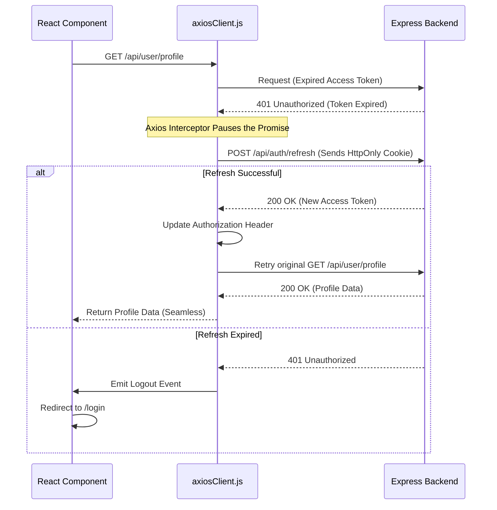

# Frontend Architecture

## 1. Overview
The mkthub frontend is a Single Page Application (SPA) built with **React 19** and **Vite**. It utilizes **Tailwind CSS** alongside **shadcn/ui** (Radix primitives) for a polished, accessible UI. State management and server-state caching are heavily offloaded to **React Query (@tanstack/react-query)**, ensuring instant UI updates and minimal network payloads.

## 2. Why this module exists
E-commerce applications require interactive, deeply nested state (cart management, multi-step checkouts, complex filtering). A traditional server-rendered MVC approach would result in sluggish page reloads. The React SPA architecture allows for instant client-side routing, optimistic UI updates, and complex client-side validation before ever hitting the backend.

## 3. Architecture

The frontend is separated into four distinct horizontal layers:
1. **API Layer (`src/api/*`):** Axios wrappers that handle network requests, base URLs, and interceptors.
2. **State Layer (`src/context/*`, React Query):** Global context for Auth/Theme, and React Query for caching server data.
3. **UI Layer (`src/components/*`):** Reusable, stateless UI building blocks (Buttons, Modals, Inputs).
4. **View Layer (`src/pages/*`):** Stateful containers that compose components and hooks to form full pages.

## 4. Execution Flows

### The Silent Token Refresh Flow
The most critical execution flow in the frontend is handling short-lived JWT Access Tokens via the Axios Interceptor (`src/api/axiosClient.js`).

## 5. Step-by-step Implementation

1. **Routing:** `App.jsx` configures `react-router-dom` to handle public routes, protected routes (requiring `isAuthenticated`), and role-based routes (e.g., `/admin/*`, `/seller/*`).
2. **Data Fetching:** When a page mounts, it utilizes custom hooks wrapping `useQuery` from React Query. This caches the response so navigating back and forth feels instantaneous.
3. **Form Handling:** Forms are managed via `react-hook-form` connected to `zod` schemas. This enforces strict, strongly-typed client-side validation that mirrors the backend's `express-validator` rules.
4. **Styling:** Tailwind CSS utility classes are merged safely using `tailwind-merge` and `clsx` (the standard `cn()` utility in `src/lib/utils.js`). This allows components to accept custom classes without style conflicts.
5. **Animations:** Micro-interactions and page transitions are handled via `framer-motion`, while smooth scrolling is provided by `lenis`.

## 6. Important Files

| File | Responsibility |
| :--- | :--- |
| `src/api/axiosClient.js` | Configures the Axios instance, injects the Bearer token, and handles 401 interceptor retry logic. |
| `src/context/AuthContext.jsx` | Provides global access to the current `user` object and `isAuthenticated` boolean. |
| `package.json` | Defines the Vite environment, React 19, and the Radix/Tailwind ecosystem. |

## 7. Important Routes
*N/A - Frontend routing is handled dynamically.*

## 8. Important Controllers
*N/A*

## 9. Important Services

| API Service | Responsibility |
| :--- | :--- |
| `src/api/authApi.js` | Abstracts the `/register`, `/login`, and `/refresh` endpoints. |
| `src/api/productApi.js` | Abstracts catalog querying and query-string generation. |

## 10. Important Middleware
*N/A - Handled via Axios Interceptors.*

## 11. Important Models
*N/A - Client-side state is strictly derived from backend JSON schemas.*

## 12. Important Utilities

| Utility | Responsibility |
| :--- | :--- |
| `src/lib/utils.js` | Contains the `cn()` function, crucial for conditional Tailwind class merging in Radix UI components. |

## 13. Engineering Decisions
> 📌 **React Query vs Redux:** Traditional SPAs use Redux for all state. However, e-commerce data (Products, Orders, Cart) is "Server State", not "Client State". React Query automatically handles caching, background refetching, and stale-time invalidation, eliminating boilerplate Redux thunks.
> 
> 📌 **shadcn/ui vs Material UI:** Material UI forces a specific Google-esque design language. shadcn/ui provides raw Radix accessibility primitives and allows complete styling control via Tailwind CSS, enabling the custom aesthetic required for mkthub.

## 14. Technologies Used
- React 19
- Vite
- Tailwind CSS
- React Query
- React Hook Form + Zod
- Framer Motion

## 15. Design Patterns Used
- **Provider Pattern:** Injecting Auth and Theme context at the root of the application tree.
- **Custom Hooks:** Encapsulating complex React Query logic (e.g., `useProducts()`) so components remain purely presentational.
- **Interceptor Pattern:** Centralizing HTTP error handling and token refreshes in `axiosClient.js`.

## 16. Software Engineering Principles
- **Separation of Concerns:** React components never import `axios` directly. They import wrapped functions from `src/api/`, making it trivial to mock APIs for testing or swap HTTP clients in the future.

## 17. Security Considerations
- > 🔒 **XSS Mitigation:** By relying entirely on React for DOM manipulation (and never using `dangerouslySetInnerHTML` unless explicitly sanitized), the frontend is naturally resistant to Cross-Site Scripting (XSS).
- > 🔒 **Token Storage:** The frontend assumes the Refresh Token is securely managed by the browser via `HttpOnly` cookies.

## 18. Performance Optimizations
- > 🚀 **Vite Bundling:** Replacing Webpack with Vite results in near-instant Hot Module Replacement (HMR) during development and heavily optimized, code-split chunking during production builds.
- > 🚀 **Request Deduping:** React Query automatically dedupes identical API requests. If three components on the same page request the user profile simultaneously, only one network request is actually sent.

## 19. Failure Scenarios
- **What breaks if missing?** If the Axios Interceptor was missing, the SPA would abruptly crash or log the user out every 15 minutes when the Access Token expires, completely ruining the checkout experience.

## 20. Future Improvements
- **Server-Side Rendering (SSR):** Currently, the SPA sends a blank HTML file and renders via JavaScript. Migrating to Next.js or Remix would allow the server to pre-render the catalog HTML, significantly improving First Contentful Paint (FCP) and SEO rankings.

## 21. Key Takeaways
- The frontend is a modern React 19 / Vite SPA.
- Data fetching and caching is exclusively managed by React Query.
- Styling relies on Tailwind CSS and accessible Radix primitives.
- API interactions are cleanly abstracted via Axios instances and interceptors.

## 22. Related Documentation
- [Authentication (authentication.md)](authentication.md)
- [Project Structure (project-structure.md)](project-structure.md)
