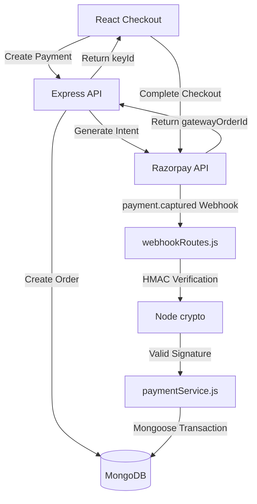
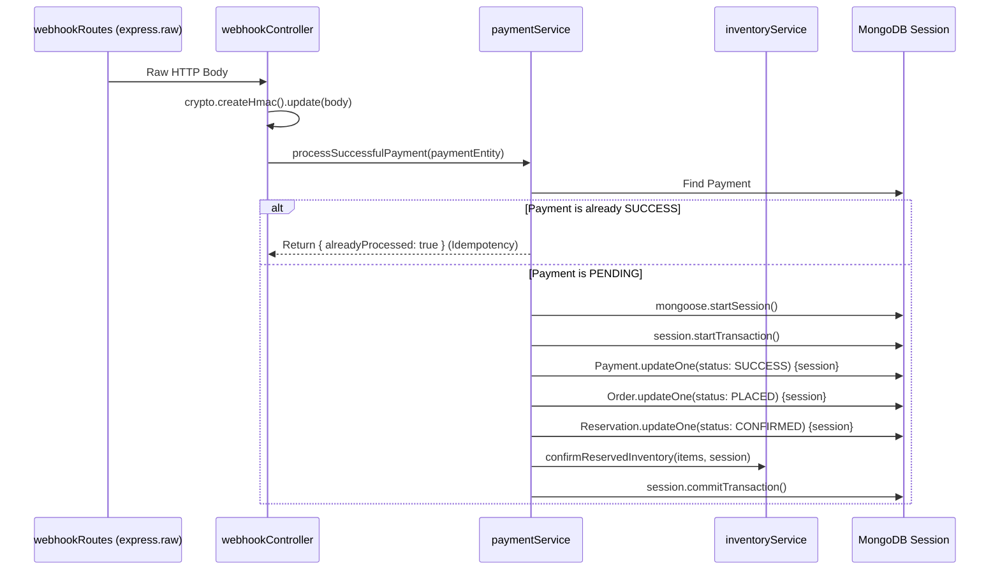

# Payment & Webhook Implementation

## 1. Overview
The mkthub backend integrates tightly with **Razorpay** to process online payments. Due to the asynchronous nature of third-party payment gateways, the architecture relies heavily on HMAC-secured webhooks, idempotent service layers, and compensation mechanisms (late capture refunds) to maintain strict transactional consistency.

## 2. Why this module exists
Processing online payments involves distributed state. An order exists in MongoDB, a payment intent exists in Razorpay, and the customer is on an external checkout page. This module exists to safely bridge the gap between Razorpay's asynchronous webhooks and MongoDB's state machine, ensuring inventory is tracked whether the payment succeeds, fails, or completes suspiciously late.

## 3. Architecture

## 4. Execution Flows

### Flow A: The Successful Webhook Transaction
The following sequence demonstrates how `webhookController.js` and `paymentService.js` safely process a Razorpay webhook.

## 5. Step-by-step Implementation

1. **Initialization:** A user POSTs to `paymentRoutes.js`. The `paymentService.js` creates a `Reservation` (locking stock), a PENDING `Order`, a PENDING `Payment`, and calls `razorpay.orders.create()`.
2. **Webhook Reception:** Razorpay fires a webhook. `src/routes/webhookRoutes.js` uses `express.raw({ type: "application/json" })` to ensure the HTTP body remains an unparsed string.
3. **HMAC Verification:** `webhookController.js` hashes the raw string using Node's `crypto` and `RAZORPAY_WEBHOOK_SECRET`. If the hash doesn't match the `x-razorpay-signature` header, it throws an `ApiError(400)`.
4. **Idempotency Check:** `paymentService.processSuccessfulPayment` checks if the payment is already `SUCCESS`. If it is, it silently ignores the duplicate webhook.
5. **Database Transaction:** The service updates the Order, Payment, and Reservation models in a single atomic Mongoose session, confirms the inventory, and enqueues an invoice PDF generation job to BullMQ.

## 6. Important Files

| File | Responsibility |
| :--- | :--- |
| `src/routes/webhookRoutes.js` | Uses `express.raw()` to bypass JSON parsing for secure HMAC verification. |
| `src/controllers/webhookController.js` | Parses the Razorpay payload and routes `payment.captured` or `refund.processed` events. |
| `src/services/paymentService.js` | Owns the business logic for creating intents and processing successful captures. |
| `src/services/refundService.js` | Owns the business logic for initiating refunds and processing Razorpay refund webhooks. |

## 7. Important Routes

| Route Module | Responsibility |
| :--- | :--- |
| `POST /api/payment/create` | Initializes the Razorpay Intent. Protected by strict express-rate-limit bounds. |
| `POST /api/webhooks/razorpay` | Consumes asynchronous updates from the Razorpay backend. |

## 8. Important Controllers

| Controller | Responsibility |
| :--- | :--- |
| `webhookController.handleRazorpayWebhook` | The security gatekeeper preventing forged webhook payloads from altering database states. |

## 9. Important Services

| Service | Responsibility |
| :--- | :--- |
| `paymentService.processSuccessfulPayment` | Executes the atomic checkout confirmation transaction. |
| `refundService.initiateLateCaptureRefund` | Acts as a compensation mechanism for out-of-sync state failures. |

## 10. Important Middleware
*N/A - Webhook verification is performed directly inside the controller rather than a middleware to ensure `req.body` stream integrity.*

## 11. Important Models

| Model | Responsibility |
| :--- | :--- |
| `src/models/Payment.js` | Stores the `gatewayOrderId` (Intent) and `gatewayPaymentId` (Actual transaction). |

## 12. Important Utilities
*N/A*

## 13. Engineering Decisions
> 📌 **Bypassing `express.json()`:** If Express parses the Razorpay webhook payload into a JSON object, the exact byte-order of the string changes. When `crypto` hashes the parsed object, it will fail to match Razorpay's HMAC signature. By isolating the webhook in `webhookRoutes.js` and using `express.raw()`, mkthub preserves byte-perfect string integrity for security verification.
> 
> 📌 **Late Capture Compensation:** Network latency can cause edge cases where a user abandons a checkout, the Cron Scheduler cancels the order and releases the inventory, but Razorpay subsequently captures the payment 5 minutes later. `paymentService.js` gracefully handles this by automatically triggering `initiateLateCaptureRefund()` to return the user's money, maintaining perfect financial and inventory consistency.

## 14. Technologies Used
- Razorpay Node.js SDK
- Node `crypto` native module
- Mongoose `ClientSession`

## 15. Design Patterns Used
- **Webhook Pattern:** Asynchronous event-driven updates.
- **Idempotency Pattern:** Ensuring duplicate `payment.captured` webhooks do not result in duplicate stock confirmations or duplicate invoice generations.
- **Compensation Pattern:** The late capture refund actively rolls back external financial state when the internal database state is no longer compatible.

## 16. Software Engineering Principles
- **Eventual Consistency:** The API returns a 201 before the payment is actually captured. The system relies on background events to eventually synchronize the DB with Razorpay.
- **Zero Trust Security:** The backend assumes any webhook could be a forged POST request from an attacker, strictly requiring HMAC validation.

## 17. Security Considerations
- > 🔒 **Rate Limiting:** `paymentRoutes.js` applies a rate limit of 10 attempts per 15 minutes. This prevents attackers from hammering the `/create` endpoint to exhaust Razorpay API limits or maliciously lock up all available inventory in PENDING reservations.

## 18. Performance Optimizations
- > 🚀 **Non-Blocking Invoices:** `processSuccessfulPayment` does not generate the PDF receipt. It simply pushes the `orderId` to `invoiceQueue`, allowing the webhook to return a `200 OK` to Razorpay in under 50ms.

## 19. Failure Scenarios
- **What breaks if missing?** If `reconcilePayment()` was omitted from the reservation cron scheduler, the cron job might cancel an order right before the webhook arrives. Without the `initiateLateCaptureRefund` fallback, the customer would lose their money and receive no product, severely damaging business trust.

## 20. Future Improvements
- **Signature Caching:** To prevent Replay Attacks, successful webhook signatures could be stored in Redis with a 24-hour TTL. If an attacker intercepts a valid webhook and replays it exactly, Redis would reject the known signature before `crypto` even computes the hash.

## 21. Key Takeaways
- mkthub uses webhooks for asynchronous payment capture.
- `express.raw()` is mandatory for secure HMAC verification.
- Edge cases like Late Captures and duplicate webhooks are handled defensively.
- Multi-document state transitions are strictly atomic via Mongoose.

## 22. Related Documentation
- [Database & Transactions (database.md)](database.md)
- [Architecture (architecture.md)](architecture.md)
