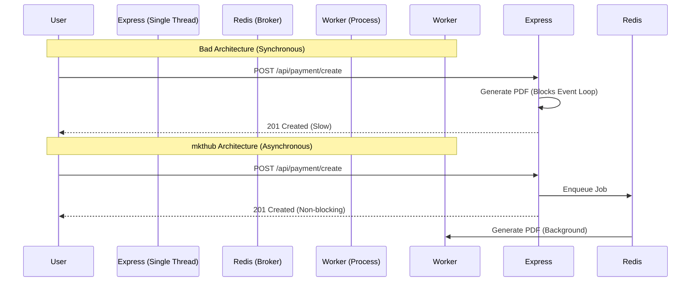

# Performance & Scalability Optimizations

## 1. Overview
The mkthub application is engineered to handle concurrent e-commerce users by systematically eliminating bottlenecks across the network, CPU, and database layers. Because Node.js is single-threaded, performance is maintained by offloading I/O to background workers and minimizing the memory footprint of database queries.

## 2. Why this module exists
E-commerce platforms are heavily read-optimized (users browse 100 products for every 1 product they buy). 
- If `ProductModel.find()` returned massive nested Mongoose objects on every scroll, the V8 Garbage Collector would pause the API.
- If generating a PDF invoice ran synchronously on the Express thread, checkout latency would spike to 3+ seconds, causing users to abandon carts.
- If pagination allowed `limit=10000`, a single user could crash the server by exhausting RAM.

## 3. Architecture

Performance is optimized across four distinct architectural planes:
1. **Database Plane:** B-Tree Indexing, Field Projection, and Lean Queries.
2. **Memory Plane:** Redis Cache-Aside for read-heavy routes.
3. **CPU Plane:** BullMQ workers for offloading PDF generation and SMTP emails.
4. **Network Plane:** Nginx reverse proxies, HTTP/2 multiplexing, and Docker image size minimization.

## 4. Execution Flows

### Synchronous Blocking vs Asynchronous Offloading
The following diagram illustrates how performance was architected for the checkout flow.

## 5. Step-by-step Implementation

1. **MongoDB Indexing:** `src/models/Product.js` defines compound indexes (`{ seller: 1, slug: 1 }`) and single indexes (`{ sellingPrice: 1 }`, `{ category: 1 }`). This allows the database engine to locate products in `O(log N)` time instead of doing full collection scans (`O(N)`).
2. **Query Projection & Lean:** Inside `src/services/productService.js`, the query explicitly selects only necessary fields (`.select("name mrp sellingPrice...")`) and chains `.lean()`. This forces Mongoose to return raw POJOs (Plain Old JavaScript Objects) instead of Mongoose Documents, reducing RAM usage.
3. **Hard Pagination Limits:** `src/utils/pagination.utils.js` enforces a `MAX_LIMIT = 100`. Even if a malicious user requests `?limit=99999`, the utility overrides it, preventing database cursor exhaustion.
4. **Batch Processing:** The Cron Scheduler (`reservationExpiryJob.js`) processes abandoned carts in strict batches of 50 (`.limit(50)`), ensuring that a massive flash sale doesn't crash the server during expiry sweeps.
5. **Docker Optimizations:** The backend image installs dependencies using `npm ci --omit=dev`, keeping massive testing/linting libraries out of production RAM. The frontend utilizes a multi-stage Nginx build to serve static assets efficiently.

## 6. Important Files

| File | Responsibility |
| :--- | :--- |
| `src/utils/pagination.utils.js` | Enforces mathematically safe defaults for all lists. |
| `src/models/Product.js` | Defines the B-Tree indexes for fast querying. |
| `src/services/productService.js` | Implements `.lean()`, projection, and Redis Cache-Aside. |

## 7. Important Routes
*N/A*

## 8. Important Controllers
*N/A*

## 9. Important Services

| Service | Responsibility |
| :--- | :--- |
| `productService.getAllProducts` | Combines Redis caching with optimized MongoDB lean queries to serve the catalog. |

## 10. Important Middleware
*N/A*

## 11. Important Models

| Model | Responsibility |
| :--- | :--- |
| `ProductModel` | Heavily indexed to support the filtering, sorting, and pagination required by the frontend catalog. |

## 12. Important Utilities

| Utility | Responsibility |
| :--- | :--- |
| `getPagination` | Sanitizes `page` and `limit` strings into safe integers, strictly enforcing `MAX_LIMIT = 100`. |

## 13. Engineering Decisions
> 📌 **`.lean()` vs Virtuals:** Mongoose `.lean()` strips all getters, setters, and virtual fields from the returned object. While virtuals are useful, `mkthub` intentionally avoids them on read-heavy models (like `Product`) so that `.lean()` can be used to maximize throughput.
> 
> 📌 **Skip/Limit Pagination:** The application currently uses `skip` and `limit` for pagination. While `skip` becomes slower at extremely high offsets (e.g., page 50,000), `MAX_LIMIT` prevents the immediate memory threat, and Redis caching masks the database latency for common pages (e.g., pages 1-10).

## 14. Technologies Used
- Redis (Caching & Job Brokering)
- BullMQ (Background Workers)
- Mongoose `.lean()`
- Nginx (HTTP/2 Multiplexing)

## 15. Design Patterns Used
- **Cache-Aside:** Masking database latency by serving hot data from RAM.
- **Asynchronous Message Passing:** BullMQ decoupling CPU-heavy tasks.
- **Data Projection:** Only pulling the exact fields required by the UI over the network.

## 16. Software Engineering Principles
- **Resource Constraints:** Intentionally bounding every input (JSON sizes, pagination limits, batch limits) to ensure the system operates within predictable memory boundaries.
- **Offload Heavy I/O:** Never blocking the Express event loop with third-party network requests (SMTP) or CPU tasks (PDFs).

## 17. Security Considerations
- > 🔒 **DOS Prevention:** Unbounded pagination is a common Denial of Service vector. `MAX_LIMIT = 100` guarantees that an attacker cannot force the database to allocate gigabytes of RAM by requesting a million records at once.

## 18. Performance Optimizations
- > 🚀 **Frontend Multi-stage Build:** By copying `/dist` into `nginx:alpine` rather than serving the React app via a Node.js process, the frontend container uses mere megabytes of RAM and leverages Nginx's C-based static file delivery speed.

## 19. Failure Scenarios
- **What breaks if missing?** If `.lean()` was removed from `getAllProducts`, the Node Garbage Collector would have to instantiate thousands of Mongoose Document objects (with internal state trackers) on every API call. Under moderate load, the GC pauses would cause API responses to stutter and eventually timeout.

## 20. Future Improvements
- **Cursor-based Pagination:** As the product catalog grows to millions of items, `skip(500000)` will become a bottleneck. Migrating from offset-based pagination to cursor-based pagination (e.g., querying `_id > lastId`) would provide `O(1)` query performance regardless of how deep the user scrolls.

## 21. Key Takeaways
- Node.js event loop blocks are avoided using BullMQ.
- MongoDB memory bloat is avoided using `.lean()`, `.select()`, and strict pagination limits.
- Read latency is minimized using Redis and Mongoose indexes.
- Flash sale memory spikes are mitigated using batch-limited Cron jobs.

## 22. Related Documentation
- [Background Workers (bullmq.md)](bullmq.md)
- [Redis Caching (redis.md)](redis.md)
- [Deployment (deployment.md)](deployment.md)
