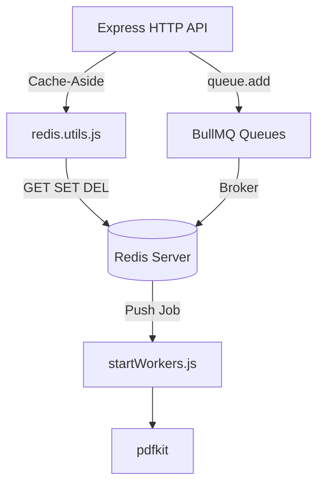
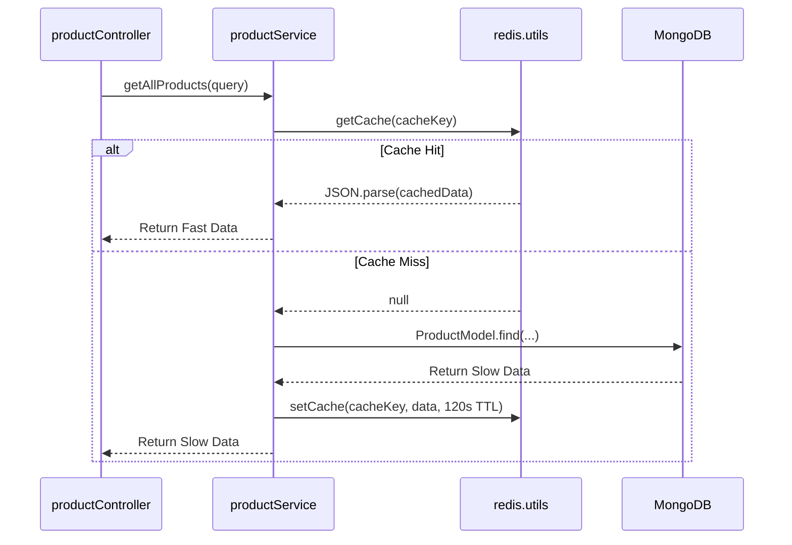
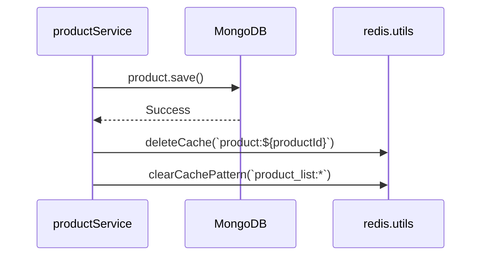

# Redis Implementation & Caching Strategy

## 1. Overview
The mkthub backend utilizes Redis (`redis` npm package) for two distinct architectural responsibilities:
1. **High-Speed Caching Layer:** Acting as a Cache-Aside data store in front of MongoDB to accelerate read-heavy operations (e.g., fetching product catalogs).
2. **Background Job Broker:** Acting as the volatile message broker for `BullMQ` to manage distributed background workers (emails, invoices).

## 2. Why this module exists
- **MongoDB Offloading:** The `getAllProducts` endpoint utilizes complex filtering, searching, and sorting. Querying this from disk on every request would exhaust CPU. Caching it in memory reduces latency dramatically.
- **Microservice Decoupling:** Directly executing `pdfkit` or `nodemailer` in the Express process blocks the event loop. Redis acts as the high-speed queue allowing `startWorkers.js` to process these heavy operations asynchronously.

## 3. Architecture

## 4. Execution Flows

### Flow A: The Cache-Aside Read
When a user requests a product list, `productService.js` executes the following flow:

### Flow B: Active Invalidation (Write-Through)
When a seller updates a product, the cache must be purged to prevent stale data.

## 5. Step-by-step Implementation

1. **Connection Setup:** `src/config/redis.js` initializes the `createClient()` singleton connected to `process.env.REDIS_HOST`.
2. **Utility Wrappers:** `src/utils/redis.utils.js` wraps standard commands (`get`, `set`, `del`, `keys`) in `try/catch` blocks so that a Redis failure doesn't crash the Node application.
3. **Cache Generation:** `productService.getAllProducts` invokes `buildProductListCacheKey(query)` to create a deterministic hash based on filters (e.g., `product_list:page=1:limit=10:category=XYZ`).
4. **Active Invalidation:** `productService.updateProduct` explicitly calls `deleteCache` on the specific product ID and uses `clearCachePattern` to wildcard-delete all `product_list:*` keys.

## 6. Important Files

| File | Responsibility |
| :--- | :--- |
| `src/config/redis.js` | Manages the TCP connection lifecycle (`connect`, `error`, `reconnecting`). |
| `src/utils/redis.utils.js` | The unified interface for Redis operations; protects services from raw Redis driver APIs. |
| `src/jobs/shared/bull.js` | Exports `redisConnection` for BullMQ queues and workers. |

## 7. Important Routes
*N/A - Redis operates entirely within the Service and Utility layers.*

## 8. Important Controllers
*N/A - Controllers remain agnostic of caching logic.*

## 9. Important Services

| Service | Responsibility |
| :--- | :--- |
| `src/services/productService.js` | Owns the Cache-Aside and cache invalidation logic for inventory browsing. |

## 10. Important Middleware
*N/A*

## 11. Important Models
*N/A - Redis manages unstructured JSON, not Mongoose schemas.*

## 12. Important Utilities

| Utility | Responsibility |
| :--- | :--- |
| `getCache` | Deserializes strings into JSON objects, returning `null` on failure. |
| `setCache` | Enforces mandatory `TTL (EX)` on all writes to prevent unbounded memory growth. |
| `clearCachePattern` | Executes `KEYS *pattern*` followed by `DEL` to batch-invalidate paginated lists. |

## 13. Engineering Decisions
> 📌 **Fault Tolerance over Strict Consistency:** In `redis.utils.js`, if `redisClient.get()` throws an error (e.g., the Redis container crashed), the utility silently catches the error and returns `null`. This forces `productService.js` into a "Cache Miss" fallback, querying MongoDB directly. The API stays alive even if the caching layer dies.

## 14. Technologies Used
- `redis` (Node.js Client)
- `ioredis` (Implicitly via BullMQ)
- Redis Server (Dockerized)

## 15. Design Patterns Used
- **Cache-Aside:** Data is loaded lazily into the cache only when requested.
- **Active Invalidation:** Mutations proactively destroy cached copies rather than waiting for TTL expiration.
- **Singleton Pattern:** Only one Redis client instance is created in `config/redis.js` and shared globally.

## 16. Software Engineering Principles
- **Graceful Degradation:** A Redis outage does not result in a 500 Internal Server Error; the application seamlessly degrades to disk-bound MongoDB reads.

## 17. Security Considerations
- > 🔒 **No Session State in Redis:** Because the authorization module relies on JWTs (`localStorage` + `HttpOnly` refresh cookies backed by MongoDB `SessionModel`), Redis is completely ephemeral. A malicious attacker flushing Redis cannot log users out or escalate privileges.

## 18. Performance Optimizations
- > 🚀 **Deterministic Key Generation:** Paginating queries dynamically creates unique cache keys. `page=1:limit=10` hits a different Redis key than `page=2:limit=10`, allowing users to infinitely scroll cached pages without triggering expensive MongoDB `skip()` offset queries.

## 19. Failure Scenarios
- **What breaks if missing?** If `clearCachePattern("product_list:*")` is omitted from `productService.updateProduct`, a seller could update a product's price from ₹500 to ₹1000, but customers browsing the catalog would continue to see the ₹500 cached price until the 120-second TTL expires.

## 20. Future Improvements
- **Replace `KEYS` with `SCAN`:** Currently, `clearCachePattern` uses the `KEYS` command. In a production cluster, running `KEYS product_list:*` is an `O(N)` operation that blocks the single-threaded Redis engine. Refactoring this to use `SCAN` with a cursor would prevent micro-stutters during cache invalidation.

## 21. Key Takeaways
- mkthub uses Redis for both caching and BullMQ background processing.
- The `redis.utils.js` wrappers prevent Redis crashes from bringing down the Express API.
- `productService.js` employs Cache-Aside with active invalidation to guarantee data freshness.

## 22. Related Documentation
- [BullMQ Queues (bullmq.md)](bullmq.md)
- [Performance (performance.md)](performance.md)
