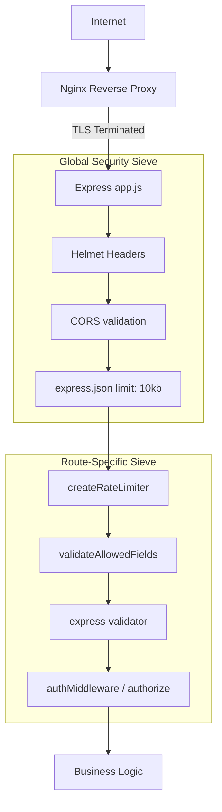
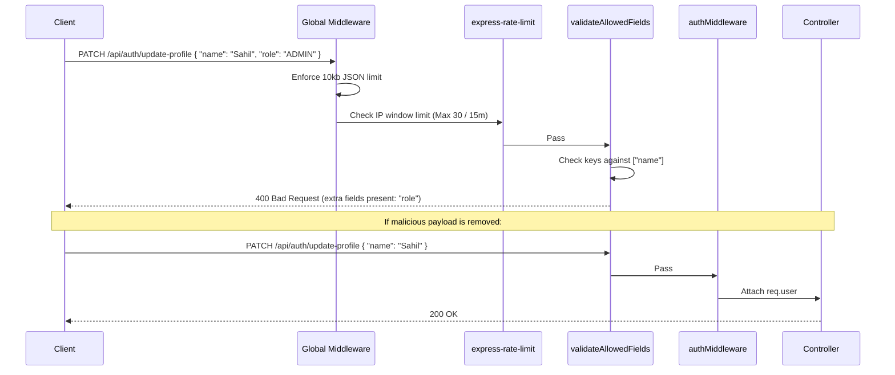

# Security Architecture

## 1. Overview
The mkthub backend employs a strict "Defense in Depth" security strategy. It utilizes a combination of globally applied middleware (like `helmet` and payload limiting) alongside route-specific guards (like strict field validation, granular rate limiting, and RBAC authorization) to protect the MongoDB database and external third-party accounts (Razorpay) from abuse.

## 2. Why this module exists
- **V8 Event Loop Protection:** Node.js is single-threaded. Maliciously sending a 50MB JSON payload to the registration endpoint would lock the CPU during `JSON.parse()`. Payload limits mitigate this.
- **Brute Force Prevention:** Passwords and OTP/Verification tokens are vulnerable to dictionary attacks. Route-specific rate limiters significantly increase the time-to-crack.
- **Mass Assignment Vulnerabilities:** If a controller uses `Object.assign(user, req.body)`, an attacker could inject `"role": "ADMIN"`. Explicit field validation strips unauthorized keys.

## 3. Architecture

The security architecture operates as a series of sequential sieves. A request must pass every sieve before touching business logic.

## 4. Execution Flows

### The Request Security Pipeline
This sequence diagram demonstrates the flow of a standard authenticated request (e.g., updating a profile) passing through the security layers.

## 5. Step-by-step Implementation

1. **Global Guards:** `src/app.js` immediately applies `helmet()` (injecting HSTS, CSP, and X-XSS-Protection headers) and limits `express.json()` and `express.urlencoded()` to `10kb`.
2. **Rate Limiting:** `src/middleware/rateLimit/createRateLimiter.js` acts as a factory, generating tailored limiters per route (e.g., 5 attempts/hour for password changes, 10 attempts/15mins for login).
3. **Mass Assignment Protection:** `src/middleware/validation/validateAllowedField.js` computes the difference between `Object.keys(req.body)` and an explicitly allowed array. If extra keys exist, it throws an `ApiError`.
4. **Data Validation:** Route files invoke `express-validator` schemas to ensure email formats, password lengths, and numeric limits are mathematically sound before hitting the database.
5. **Data at Rest Protection:** `src/services/authService.js` explicitly invokes `bcrypt.hash()` to automatically salt and hash passwords before passing them to the Mongoose model, ensuring plaintext credentials never enter MongoDB.

## 6. Important Files

| File | Responsibility |
| :--- | :--- |
| `src/app.js` | Defines the global, non-bypassable security middleware chain. |
| `src/middleware/rateLimit/createRateLimiter.js` | Exports the configured memory-store rate limiting factory. |
| `src/middleware/validation/validateAllowedField.js` | Defines the strict "allowlist" filter for incoming payloads. |

## 7. Important Routes

| Route Module | Responsibility |
| :--- | :--- |
| `src/routes/authRoutes.js` | Heavily rate-limited due to the sensitivity of password/session endpoints. |
| `src/routes/webhookRoutes.js` | Bypasses `express.json()` globally by executing `express.raw()` beforehand to preserve HMAC integrity. |

## 8. Important Controllers
*N/A - Security is enforced via middleware before reaching controllers.*

## 9. Important Services
*N/A*

## 10. Important Middleware

| Middleware | Responsibility |
| :--- | :--- |
| `helmet` | Defends against common browser-based attacks (XSS, Clickjacking, MIME-sniffing). |
| `authMiddleware.js` | Validates JWT signatures and checks MongoDB `SessionModel` for token revocation. |
| `authorize.js` | Enforces Role-Based Access Control (RBAC) dynamically based on `req.user.role`. |

## 11. Important Models

| Model | Responsibility |
| :--- | :--- |
| `src/models/User.js` | Enforces `select: false` on the password field to prevent accidental leakage in queries. Hashing logic is explicitly maintained in the service layer. |

## 12. Important Utilities
*N/A*

## 13. Engineering Decisions
> 📌 **Reject vs Sanitize:** `validateAllowedFields` throws a 400 error rather than silently sanitizing (deleting) the bad keys. This is a "Fail-Fast" decision. If an API consumer is sending invalid data, rejecting the request forces them to fix their client, whereas silently deleting keys can lead to unpredictable behavior.
>
> 📌 **Global JSON Limits:** E-commerce systems rarely need large JSON payloads. By globally setting `limit: "10kb"`, mkthub guarantees that Node's V8 engine cannot be choked by giant JSON strings. Images are handled via `multer` (multipart/form-data), bypassing the JSON parser.

## 14. Technologies Used
- `helmet`
- `express-rate-limit`
- `bcrypt`
- Node `crypto` (HMAC for Webhooks)

## 15. Design Patterns Used
- **Chain of Responsibility:** Express middleware acts as a sequential chain where any link can terminate the request early.
- **Factory Pattern:** `createRateLimiter(window, max, message)` generates unique middleware instances per route configuration.

## 16. Software Engineering Principles
- **Defense in Depth:** Security isn't reliant on a single feature. Even if an attacker bypasses the frontend, the global payload limit, the rate limiter, and the schema validator, they still hit the allowed-fields strict whitelist.
- **Principle of Least Privilege:** Users cannot arbitrarily mutate database records; they are strictly bound by `req.user._id` matching the document owner, or by possessing the `ADMIN` role.

## 17. Security Considerations
- > 🔒 **Cookie Security:** The application issues Refresh Tokens using `HttpOnly` cookies. This prevents malicious JavaScript (XSS attacks) from reading the token. The Access Token is stored in memory/localStorage because it is short-lived (15 minutes).

## 18. Performance Optimizations
- > dYs? **Early Rejection:** By placing rate-limiters and field validators *before* `express-validator` and `authMiddleware`, mkthub rejects malicious requests instantly, saving CPU cycles that would otherwise be spent verifying JWT signatures or running regex checks.

## 19. Failure Scenarios
- **What breaks if missing?** If `validateAllowedFields` was removed from `authRoutes.js`, a user POSTing to `/register` could easily include `"role": "ADMIN"`, granting themselves total control over the e-commerce platform upon account creation.

## 20. Future Improvements
- **Distributed Rate Limiting:** Currently, `express-rate-limit` uses a memory store. If mkthub scales to 5 Node.js containers, an attacker gets 5x the rate limit (10 attempts *per container*). Connecting `express-rate-limit` to the existing Redis instance would enforce a global rate limit across the entire cluster.

## 21. Key Takeaways
- mkthub employs strict JSON payload limiting to prevent DOS.
- `validateAllowedFields` completely eliminates Mass Assignment vulnerabilities.
- Rate limiting is aggressively applied to authentication and payment paths.
- Security middleware executes in an optimized "Fail-Fast" sequence.

## 22. Related Documentation
- [Authentication (authentication.md)](authentication.md)
- [Authorization & RBAC (authorization.md)](authorization.md)
- [Payment & Webhooks (payment.md)](payment.md)
